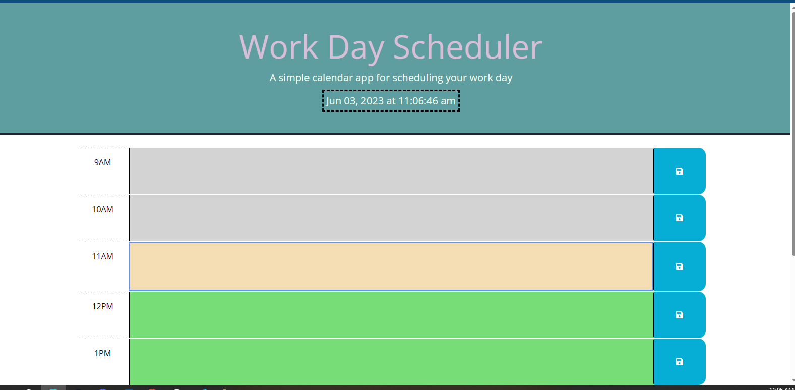

# Work-Day-Scheduler

[My Live Site](https://teelsam.github.io/Work-Day-Scheduler/)

## Description

Here is a daily planner which could be used for a 9-5 job. Typing in your plans and pressing the blue save button saves the plans to your local storage. Also as the day passes the hour pannels change color. Grey is the past, sandy yellow is the present and green is the future. The time of day and date is displayed and continually updated through the day.

## Table of Contents

An index.html which holds the structure of the site.
This README file.
An assets folder containing style.css file loading the sites design, and a script.js file which runs the sites content.
as well as a screenshot of the live site.

## ScreenShot

## Third Party APIs and Fonts

[Jquery](https://api.jquery.com/) /n
[DayJs](https://day.js.org/en/)/n
[google Fonts](https://fonts.google.com/)/n
[font awesome](https://fontawesome.com)/n
[Bootstrap](https://getbootstrap.com/)
